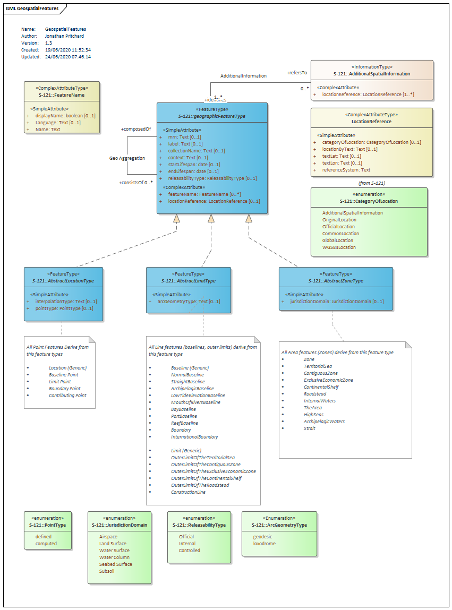
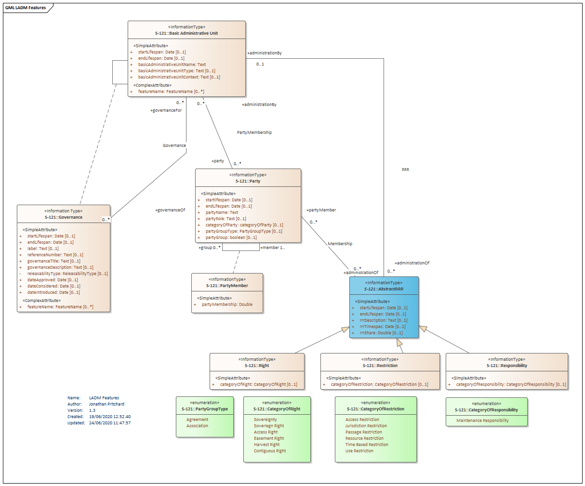
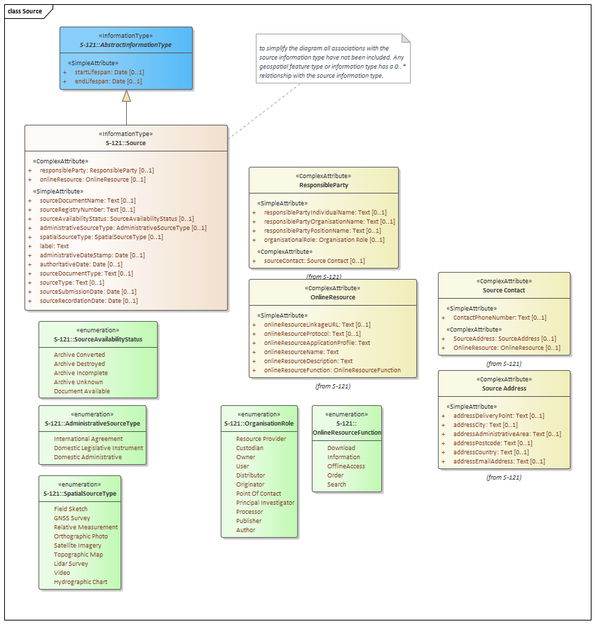

# Documentation for the GML Annex to S-121. 

Documentation for the GML Annex is contained here. This is built off the revised UML diagrams produced in the OGC Pilot Project for each of the three main packages

* Geospatial Features
* LADM Information Types
* Source Information Type

## Geospatial Features

## LADM Information Types

## Source

